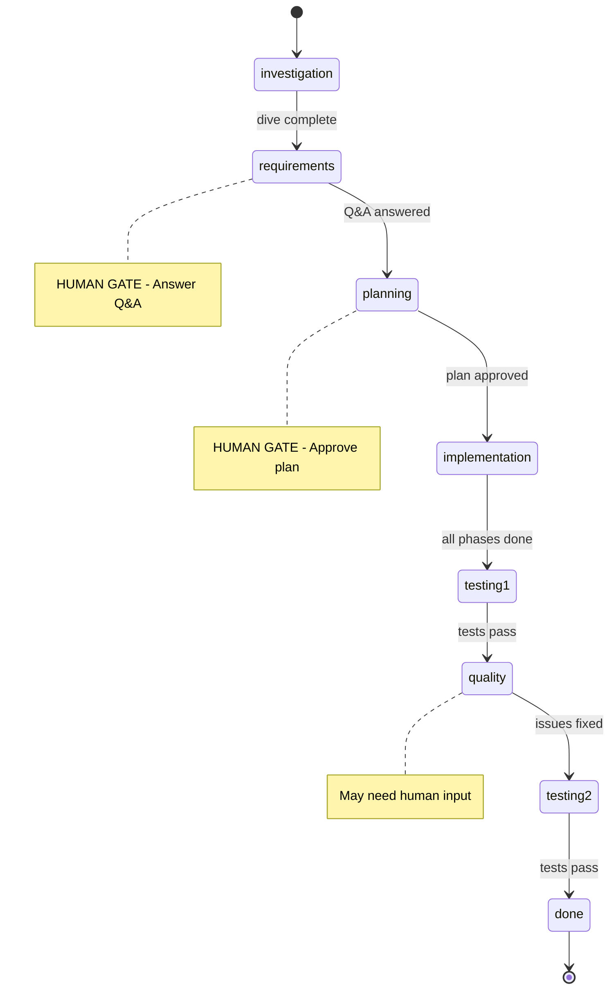
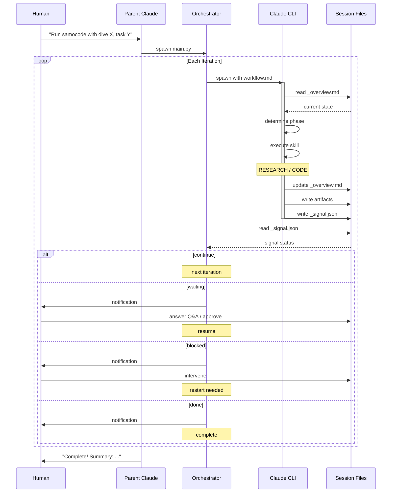

# Samocode - Autonomous Session Orchestrator

This is Claude automation the way I find most effective for my personal tasks. Currently it's essentially a supervised agentic loop. It's good at both research and coding (better as separate tasks) and capable of doing pretty big pieces end-to-end. The emergent behavior of earning money for its owner is still TBD. Reviewing the code it produces for production is highly recommended.

---

A "dumb" Python orchestrator that runs Claude Code CLI in a loop. Claude reads session state, decides actions via skills, updates state, and signals flow control. Human intervention happens via samocode-parent at key decision points (human gates).

## Installation

### 1. Install Skills & Commands

```bash
# Run the install script (creates symlinks to ~/.claude/)
cd ~/samocode
./install.sh

# Restart Claude Code to apply changes
```

To uninstall: `./uninstall.sh`

### 2. Install Python Dependencies

```bash
cd ~/samocode
pip install -r requirements.txt
```

### 3. Configure Environment

```bash
cp .env.example .env
# Edit .env with your settings:
# - CLAUDE_PATH (path to claude CLI)
# - TELEGRAM_BOT_TOKEN (optional - for notifications)
# - TELEGRAM_CHAT_ID (optional - for notifications)
```

### 4. Configure Project `.samocode` File

Samocode needs to know where to store its working data for each project:
- **Sessions**: Folders containing task state, plans, Q&A docs, and artifacts for each autonomous run
- **Worktrees**: Git worktrees for isolated branch work (optional, for repo-based sessions)

Create a `.samocode` file in your project root:

```
MAIN_REPO=~/your-project/repo
WORKTREES=~/your-project/worktrees/
SESSIONS=~/your-project/_sessions/
```

Samocode-parent reads this file and passes paths to the worker. See [Configuration](#configuration) for details.

## Quick Start

**Step 1: Start Claude in your project directory**
```bash
cd ~/your-project
claude
```

**Step 2: Start a new samocode session**
```
You: "Run samocode with dive into our authentication architecture
      and existing user models. Task: add JWT-based user authentication."
```

Samocode takes two key parameters:
- **dive**: what to investigate first (codebase exploration phase)
- **task**: what to implement after understanding the code

Samocode-parent will:
1. Read `.samocode` → get SESSIONS, WORKTREES, MAIN_REPO paths
2. Start the worker with project-specific config
3. Monitor and report: "Iteration 3, implementation phase..."

**Step 3: Answer Q&A when needed**
```
Samocode-Parent: "Samocode is waiting. Questions in _qa.md:
  Q1: Which auth method? (JWT/OAuth/Session)
  Q2: Where to store tokens?"

You: "JWT, store in httpOnly cookies"
```

Parent updates `_qa.md` and continues the worker.

**Tip:** You can say "accept all suggestions" to let parent auto-fill answers with the suggested options.

**Step 4: Review completion**
```
Samocode-Parent: "Complete after 8 iterations. Created:
  - auth middleware
  - login/logout endpoints
  - JWT token handling
  All tests passing."
```

### Alternative: Manual Session Start (Optional)

You can also create a session first with `/session-start`:
```
You: /session-start auth-feature
You: /samocode-run
```

This is optional - samocode auto-creates sessions when given dive and task.

## Architecture

Samocode has a three-layer architecture:

```
┌─────────────────────────────────────────────────────────────────┐
│  SAMOCODE-PARENT (Your interactive Claude session)             │
│  - You talk to this Claude directly                            │
│  - Runs in your project directory (e.g., ~/avon-ai)            │
│  - Reads project's .samocode file for paths                    │
│  - Starts worker.py with project-specific config               │
│  - Monitors progress, answers Q&A, debugs issues               │
└─────────────────────────────────────────────────────────────────┘
                              │
                              ▼
┌─────────────────────────────────────────────────────────────────┐
│  WORKER (Python orchestrator - "dumb")                          │
│  - Runs: python ~/samocode/main.py --session ...               │
│  - Receives SESSIONS_DIR, WORKTREES_DIR from parent            │
│  - Spawns Claude CLI for each iteration                        │
│  - Reads signals, sends Telegram notifications                 │
└─────────────────────────────────────────────────────────────────┘
                              │
                              ▼
┌─────────────────────────────────────────────────────────────────┐
│  SAMOCODE-CHILD (Spawned Claude CLI instances)                 │
│  - Runs with cwd = Working Dir from _overview.md               │
│  - Receives workflow.md as prompt                              │
│  - Reads session state, executes skills, writes signal         │
│  - Each iteration is a fresh Claude instance                   │
└─────────────────────────────────────────────────────────────────┘
```

**Key principle**: Python worker is dumb. It just:
1. Invokes Claude CLI with workflow prompt
2. Reads signal file after Claude exits
3. Decides: continue loop, stop, or notify human

Claude decides everything by reading `_overview.md` and using skills.

### Why Samocode-Parent Matters

1. **Project Context**: Parent reads your project's `.samocode` file and knows project-specific paths
2. **Path Injection**: Parent passes `SESSIONS_DIR` and `WORKTREES_DIR` to worker
3. **Monitoring**: Parent watches worker output and reports progress to you
4. **Debugging**: When things go wrong, parent can analyze and fix issues
5. **Human Gates**: Parent handles approval checkpoints (Q&A answers, plan approval) on your behalf

## Workflow Phases

```
investigation → requirements → planning → implementation → testing → quality → done
                     │              │                         ↑          │       ↑
                     └──────────────┴── HUMAN GATES ──────────┘          └───────┘
                                    (parent handles)                  (fix loop if
                                                                      blocking issues)
```

| Phase | Skill | Human Gate? | Description |
|-------|-------|-------------|-------------|
| investigation | `dive` | No | Understand the problem space |
| requirements | `task` | **Yes** | Q&A with human via `_qa.md` |
| planning | `planning` | **Yes** | Create plan, wait for approval |
| implementation | `dop2` (default) | No | Execute plan phases |
| testing | `testing` | No | Verify feature works |
| quality | `cleanup`, `multi-review` | No | Clean up and review code |
| done | - | No | Generate summary |

### Human Gates

Samocode pauses at key decision points for human approval:

1. **Requirements Gate** (after investigation): Q&A questions in `_qa.md` - clarify scope, preferences, constraints
2. **Planning Gate** (after requirements): Review implementation plan before execution starts

Parent Claude handles these gates on your behalf - answering questions, approving plans, or escalating to you when needed.

## Configuration

### `.samocode` File (Required per project)

Create a `.samocode` file in each project root. **All three fields are required:**

| Key | Description |
|-----|-------------|
| `MAIN_REPO` | Main git repository path (**required**) |
| `WORKTREES` | Where git worktrees are created (**required**) |
| `SESSIONS` | Where session folders are stored (**required**) |

Example:
```
MAIN_REPO=~/project/repo
WORKTREES=~/project/worktrees/
SESSIONS=~/project/_sessions/
```

### Environment Variables (`.env` file)

| Variable | Default | Description |
|----------|---------|-------------|
| `CLAUDE_PATH` | `claude` | Path to Claude CLI |
| `TELEGRAM_BOT_TOKEN` | - | (Optional) Telegram bot token for notifications |
| `TELEGRAM_CHAT_ID` | - | (Optional) Telegram chat ID for notifications |
| `CLAUDE_MODEL` | `opus` | Model to use |
| `CLAUDE_MAX_TURNS` | `120` | Max turns per iteration |
| `CLAUDE_TIMEOUT` | `600` | Timeout in seconds |
| `SAMOCODE_MAX_RETRIES` | `3` | Retry attempts on failure |
| `SAMOCODE_RETRY_DELAY` | `5` | Delay between retries (seconds) |

**Note:** All project paths (MAIN_REPO, WORKTREES, SESSIONS) come from the `.samocode` file, not environment variables.

## Worker CLI Reference

The worker is normally started by samocode-parent, but can be run directly for debugging or advanced use.

### CLI Arguments

| Argument | Required | Description |
|----------|----------|-------------|
| `--config` | **Yes** | Path to `.samocode` config file |
| `--session` | **Yes** | Session name (not full path) |
| `--dive` | No | Initial dive topic (first run only) |
| `--task` | No | Initial task definition (first run only) |
| `--dry-run` | No | Show config without executing |

### Starting a New Session

```bash
python main.py --config ~/project/.samocode --session my-task \
  --dive "current API structure" \
  --task "Redesign the REST API"
```

### Continuing an Existing Session

```bash
python main.py --config ~/project/.samocode --session my-task
```

Session resolution:
1. Exact match: `{SESSIONS}/my-task/`
2. Dated match: `{SESSIONS}/*-my-task/` (most recent)
3. New session: `{SESSIONS}/{YY-MM-DD}-my-task/`

### Dry Run

```bash
python main.py --config ~/project/.samocode --session test --dry-run
```

### Session Naming

Session name is auto-prefixed with date: `my-task` → `26-01-08-my-task`

## Signal File Format

Claude writes `_signal.json` to control flow:

### continue
```json
{"status": "continue"}
```
Orchestrator loops to next iteration.

### done
```json
{"status": "done", "summary": "Brief description of what was accomplished"}
```
Workflow complete. Orchestrator stops.

### blocked
```json
{"status": "blocked", "reason": "Clear description", "needs": "human_decision"}
```
Stop and notify human via Telegram.

`needs` values: `human_decision`, `clarification`, `error_resolution`

### waiting
```json
{"status": "waiting", "for": "qa_answers"}
```
Pause for human input. Check `_qa.md` for questions.

`for` values: `qa_answers`, `file_update`

## Session Structure

```
~/project/_sessions/26-01-08-my-task/
├── _overview.md          # Session state (Status section)
├── _qa.md                # Q&A questions/answers (temporary)
├── _signal.json          # Flow control signal
├── _logs/                # Agent iteration logs (JSONL)
│   ├── 01-08-100532-investigation.jsonl
│   └── 01-08-103045-implementation.jsonl
├── 01-08-10:00-dive-*.md # Investigation documents
├── 01-08-10:30-task-*.md # Task definition
├── 01-08-11:00-plan-*.md # Implementation plan
├── 01-08-11:30-*.md      # Implementation docs
└── ...
```

### _overview.md Status Section

```markdown
## Status
Phase: implementation
Iteration: 3
Blocked: no
Last Action: Completed Phase 2
Next: Execute Phase 3
```

## Telegram Notifications

Notifications sent for:
- **Blocked**: Workflow hit an issue requiring human decision
- **Waiting**: Q&A questions ready in `_qa.md`
- **Complete**: Workflow finished successfully
- **Error**: Orchestrator crashed or Claude failed

## Logging

Logs written to `logs/samocode.log`:
- Rotating file handler (1MB max, 5 backups)
- Also outputs to console
- Format: `[YYYY-MM-DDTHH:MM:SS] LEVEL - message`

## Skills Reference

Skills are used internally by samocode during autonomous execution. Located in `./skills/`:

| Skill | Actions | Description |
|-------|---------|-------------|
| `session-management` | `start`, `continue`, `sync`, `archive` | Session lifecycle |
| `investigation` | - | Deep dive on topics |
| `task-definition` | - | Interactive task definition with Q&A |
| `planning` | - | Create implementation plans |
| `implementation` | `do`, `dop`, `dop2` | Execute tasks/phases |
| `quality` | `cleanup`, `multi-review` | Code cleanup and review |
| `summary` | - | Generate PR descriptions |
| `testing` | - | Test implemented features |
| `samocode-run` | - | Run samocode orchestrator |

## Commands Reference

Commands are standalone utilities that work independently of samocode. They don't use or require the samocode orchestrator - you can use them directly in any Claude Code session. Located in `./commands/`:

| Command | Description |
|---------|-------------|
| `/dive` | Start investigation on a topic |
| `/task` | Define task with Q&A |
| `/create-plan` | Create implementation plan |
| `/do` | Execute single task |
| `/do2` | Execute with dual-agent comparison |
| `/dop` | Execute plan phase |
| `/dop2` | Execute plan phase with dual-agent |
| `/cleanup` | Run code cleanup |
| `/multi-review` | Run multi-perspective code review |
| `/summary` | Generate PR summary |
| `/session-start` | Start new session |
| `/session-continue` | Continue existing session |
| `/session-sync` | Sync session state |
| `/session-archive` | Archive completed session |

## Project Structure

```
~/samocode/
├── main.py               # Entry point - orchestrator loop
├── workflow.md           # Master prompt for Claude
├── worker/               # Core worker package
│   ├── __init__.py
│   ├── config.py         # Configuration from environment
│   ├── signals.py        # Signal file operations
│   ├── runner.py         # Claude CLI execution with retry
│   ├── notifications.py  # Telegram notifications
│   └── logging.py        # Logging configuration
├── skills/               # Claude Code skills (9 skills)
├── commands/             # Claude Code commands (14 commands)
├── install.sh            # Install skills/commands to ~/.claude/
├── uninstall.sh          # Remove installed skills/commands
├── _samocode/            # This repo's own session
└── logs/                 # Runtime logs
```

## Diagrams

### Workflow Phases



### Core Flow


