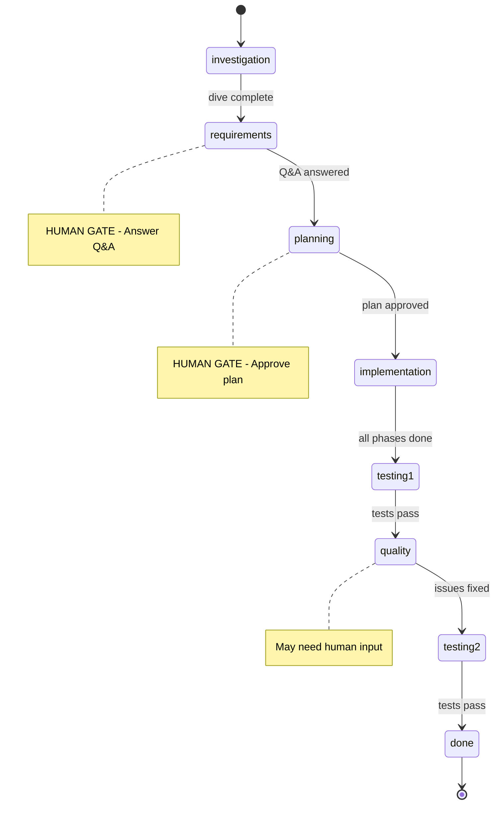
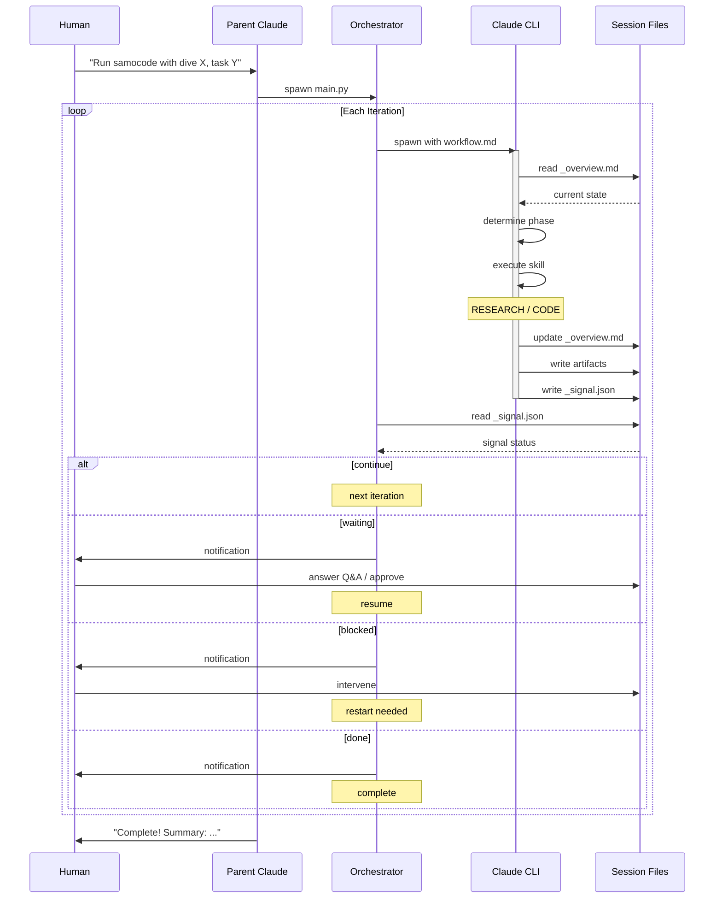

# Samocode - Autonomous Session Orchestrator

## Explain Like I'm 10

Imagine you have a really smart helper (Claude) that can read code and write code. But it forgets everything after each conversation. So we built a system where:

1. **A notebook** (`_overview.md`) keeps track of what's been done and what's next
2. **A simple loop** (Python script) wakes up Claude, says "read the notebook and do the next thing", then waits
3. Claude reads the notebook, does one piece of work, writes what happened back in the notebook, and goes to sleep
4. The loop wakes Claude up again, and repeats until the job is done
5. **You** (through a parent Claude session) watch the progress and answer questions when Claude needs help

That's it. The Python loop is intentionally dumb - Claude makes all the decisions.

---

Claude automation the way I find most effective for my personal tasks. Currently an essentially supervised agentic loop. Good at both research and coding (better as separate tasks), capable of doing big pieces end-to-end. Reviewing the code it produces for production is highly recommended.

## Installation

```bash
cd ~/samocode
./install.sh          # Creates symlinks to ~/.claude/
pip install -r requirements.txt

# Optional: configure environment
cp .env.example .env  # Set CLAUDE_PATH, Telegram tokens, etc.
```

For each project, create a `.samocode` file in the project root:
```
MAIN_REPO=~/your-project/repo
WORKTREES=~/your-project/worktrees/
SESSIONS=~/your-project/_sessions/
```

## Quick Start

Start Claude in your project directory and tell it what to do:
```
You: "Run samocode with dive into our authentication architecture
      and existing user models. Task: add JWT-based user authentication."
```

Samocode-parent will start the worker, monitor progress, and report back. When samocode has questions, parent relays them to you:
```
Parent: "Questions in _qa.md: Which auth method? Where to store tokens?"
You:    "JWT, httpOnly cookies"
```

## Architecture

Three layers: **Parent Claude** (your session) → **Worker** (Python loop) → **Child Claude** (per-iteration instances)

```
Parent Claude          Worker (Python)           Child Claude
─────────────         ────────────────          ─────────────
You talk here    →    Spawns Claude CLI    →    Reads _overview.md
Monitors progress     Reads signals             Executes one action
Handles Q&A           Sends notifications       Writes signal
```

The Python worker is intentionally dumb - it just invokes Claude, reads the signal file, and decides: loop, stop, or notify human. Claude makes all decisions.

## Phases

```
investigation → requirements → planning → implementation → testing → quality → done
                    ↑              ↑
               HUMAN GATE     HUMAN GATE
              (answer Q&A)   (approve plan)
```

| Phase | What happens |
|-------|-------------|
| investigation | Explore the codebase |
| requirements | Q&A with human via `_qa.md` |
| planning | Create plan, wait for approval |
| implementation | Execute plan |
| testing | Verify the feature works |
| quality | Code review and cleanup |
| done | Generate summary |

## Configuration

### `.samocode` File (per project, all required)

| Key | Description |
|-----|-------------|
| `MAIN_REPO` | Main git repository path |
| `WORKTREES` | Where git worktrees are created |
| `SESSIONS` | Where session folders are stored |

### Environment Variables (`.env`, optional)

| Variable | Default | Description |
|----------|---------|-------------|
| `CLAUDE_PATH` | `claude` | Path to Claude CLI |
| `CLAUDE_MODEL` | `opus` | Model to use |
| `CLAUDE_TIMEOUT` | `1800` | Timeout per iteration (seconds) |
| `TELEGRAM_BOT_TOKEN` | - | Telegram notifications |
| `TELEGRAM_CHAT_ID` | - | Telegram notifications |

## Worker CLI

Normally started by parent, but can be run directly:

```bash
# New session
python main.py --config ~/project/.samocode --session my-task \
  --dive "current API structure" --task "Redesign the REST API"

# Continue existing session
python main.py --config ~/project/.samocode --session my-task
```

## Signal Protocol

Claude writes `_signal.json` to control flow:

| Signal | Effect | Example |
|--------|--------|---------|
| `continue` | Next iteration | `{"status": "continue"}` |
| `done` | Stop | `{"status": "done", "summary": "..."}` |
| `blocked` | Stop + notify | `{"status": "blocked", "reason": "...", "needs": "human_decision"}` |
| `waiting` | Pause for input | `{"status": "waiting", "for": "qa_answers"}` |

## Session Structure

```
_sessions/26-01-08-my-task/
├── _overview.md              # Session state
├── _qa.md                    # Q&A (when waiting for human)
├── _signal.json              # Flow control
├── _logs/                    # Iteration logs (JSONL)
├── 01-08-10:00-dive-*.md     # Investigation docs
├── 01-08-11:00-plan-*.md     # Plans
└── ...                       # Other artifacts
```

## Commands

Standalone utilities, work without the orchestrator:

| Command | Description |
|---------|-------------|
| `/dive` | Investigate a topic |
| `/task` | Define task with Q&A |
| `/create-plan` | Create implementation plan |
| `/do`, `/do2` | Execute task (single / dual-agent) |
| `/dop`, `/dop2` | Execute plan phase (single / dual-agent) |
| `/cleanup` | Code cleanup analysis |
| `/multi-review` | Multi-perspective code review |
| `/session-start`, `/session-continue`, `/session-archive` | Session management |

## Diagrams

### Workflow Phases



### Core Flow


