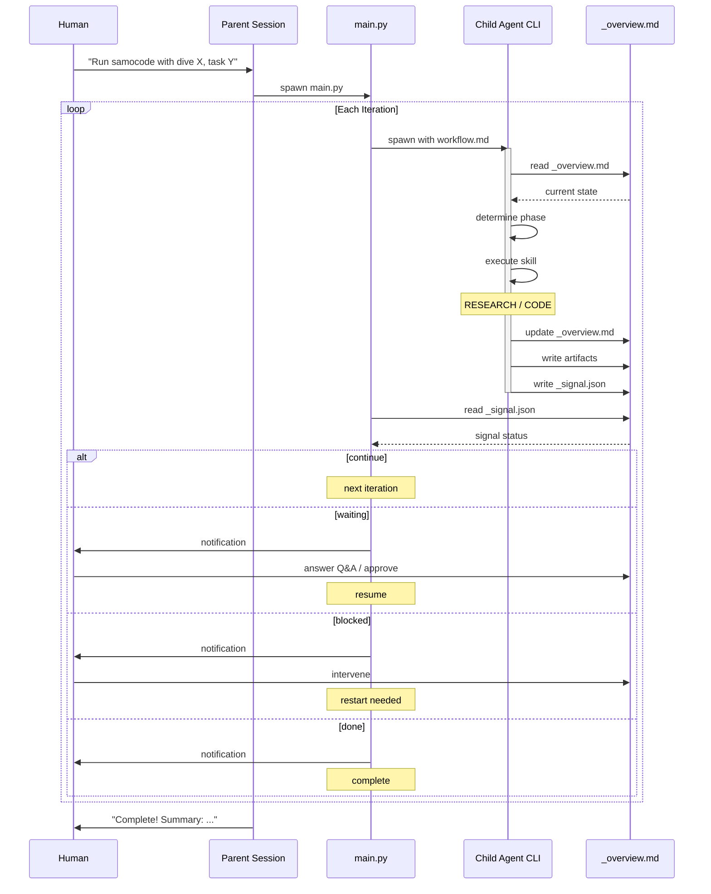

<div align="center">

# samocode

**Walk-away AI coding sessions, locally orchestrated.**
Drives Claude (primary) or Codex through full SDLC phases with human gates,
so you can hand off multi-hour engineering work and walk away.

[](https://pypi.org/project/samocode/)
[](LICENSE)
[](https://www.python.org/)
[](https://github.com/Yuvasee/samocode/actions/workflows/ci.yml)

[Quick start](#quick-start) · [How it works](#how-it-works) · [vs alternatives](#vs-alternatives) · [Examples](examples/)

</div>

---

## What this is

You give samocode a real engineering task — research a codebase, plan a refactor, implement a feature, run tests, clean up. It runs an AI CLI in a loop, walking your task through investigation → planning → implementation → testing → quality phases. It pauses to ask you questions when it needs to (`_qa.md`), waits for plan approval, and notifies you on Telegram when something needs your attention. You come back two hours later, your branch has the work done, with commits, tests, and a summary.

It's open-source, provider-agnostic (works with Claude, Codex, or Gemini CLI), and runs locally — no SaaS, no proxy, your code never leaves your machine.

Not an engineer? See [docs/eli10.md](docs/eli10.md) for a friendly walkthrough.

## When this is useful

- "Add JWT auth to this Express app, write tests, make sure CI passes." (90 min unattended)
- "Investigate how rate-limiting currently works in this codebase, then design a new sliding-window approach." (45 min unattended)
- "Refactor this 800-line file into focused modules, keep the test suite green." (2 hours unattended)
- "Run the linter on the whole repo, fix every issue except the ones in `legacy/`." (30 min unattended)

If your task is "I need to think about this with the AI for 10 minutes" — use Claude / Cursor / Aider directly. samocode is for the cases where you'd rather walk away.

## Installation

```bash
cd ~/samocode
./install.sh          # Creates symlinks to ~/.claude/ (skills/commands/agents)
pip install -r requirements.txt

# Optional: configure environment
cp .env.example .env  # Set provider, CLI paths/models, Telegram tokens, etc.
```

For each project, create a `.samocode` file in the project root:
```
MAIN_REPO=~/your-project/repo
WORKTREES=~/your-project/worktrees/
SESSIONS=~/your-project/_sessions/
```

## Quick Start

Start your agent session in the project directory and tell it what to do:
```
You: "Run samocode with dive into our authentication architecture
      and existing user models. Task: add JWT-based user authentication."
```

The parent session starts the worker, monitors progress, and reports back. When samocode has questions, parent relays them to you:
```
Parent: "Questions in _qa.md: Which auth method? Where to store tokens?"
You:    "JWT, httpOnly cookies"
```

## Architecture

Three layers: **Parent session** (your chat) → **Worker** (Python loop) → **Child AI CLI** (per-iteration instances)

```
Parent Session         Worker (Python)          Child Agent CLI
──────────────        ────────────────         ───────────────
You talk here    →    Spawns provider CLI  →   Reads _overview.md
Monitors progress     Reads signals            Executes one action
Handles Q&A           Sends notifications      Writes signal
```

The Python worker is intentionally dumb: it invokes the configured provider, reads `_signal.json`, and decides loop/stop/pause. The child agent performs the real work.

## Phases

```
investigation → requirements → planning → implementation → testing → quality → done
                    ↑              ↑
               HUMAN GATE     HUMAN GATE
              (answer Q&A)   (approve plan)
```

| Phase | What happens |
|-------|-------------|
| investigation | Explore the codebase |
| requirements | Q&A with human via `_qa.md` |
| planning | Create plan, wait for approval |
| implementation | Execute plan |
| testing | Verify the feature works |
| quality | Code review and cleanup |
| done | Generate summary |

## Configuration

### `.samocode` File (per project, all required)

| Key | Description |
|-----|-------------|
| `MAIN_REPO` | Main git repository path |
| `WORKTREES` | Where git worktrees are created |
| `SESSIONS` | Where session folders are stored |

### Environment Variables (`.env`, optional)

| Variable | Default | Description |
|----------|---------|-------------|
| `SAMOCODE_PROVIDER` | `claude` | Provider: `claude` or `codex` |
| `CLAUDE_PATH` | `claude` | Path to Claude CLI |
| `CLAUDE_MODEL` | `opus` | Claude model |
| `CLAUDE_TIMEOUT` | `1800` | Claude timeout per iteration (seconds) |
| `CODEX_PATH` | `codex` | Path to Codex CLI |
| `CODEX_MODEL` | empty | Codex model (empty = use `~/.codex/config.toml`) |
| `CODEX_TIMEOUT` | `1800` | Codex timeout per iteration (seconds) |
| `TELEGRAM_BOT_TOKEN` | - | Telegram notifications |
| `TELEGRAM_CHAT_ID` | - | Telegram notifications |

## Worker CLI

Normally started by parent, but can be run directly:

```bash
# New session
python main.py --config ~/project/.samocode --session my-task \
  --dive "current API structure" --task "Redesign the REST API"

# Continue existing session
python main.py --config ~/project/.samocode --session my-task

# Run with Codex provider for this invocation
python main.py --config ~/project/.samocode --session my-task --provider codex
```

## Provider Notes

- Default provider is `claude` (`SAMOCODE_PROVIDER=claude`).
- Set `SAMOCODE_PROVIDER=codex` (or `--provider codex`) to run iterations with Codex.
- In Claude mode, samocode uses native Claude agent flags.
- In Codex mode, samocode injects the selected phase agent instructions into the iteration prompt.

## Signal Protocol

The child agent writes `_signal.json` to control flow:

| Signal | Effect | Example |
|--------|--------|---------|
| `continue` | Next iteration | `{"status": "continue"}` |
| `done` | Stop | `{"status": "done", "summary": "..."}` |
| `blocked` | Stop + notify | `{"status": "blocked", "reason": "...", "needs": "human_decision"}` |
| `waiting` | Pause for input | `{"status": "waiting", "for": "qa_answers"}` |

## Session Structure

```
_sessions/26-01-08-my-task/
├── _overview.md              # Session state
├── _qa.md                    # Q&A (when waiting for human)
├── _signal.json              # Flow control
├── _logs/                    # Iteration logs (JSONL)
├── 01-08-10:00-dive-*.md     # Investigation docs
├── 01-08-11:00-plan-*.md     # Plans
└── ...                       # Other artifacts
```

## Commands

Standalone utilities, work without the orchestrator:

| Command | Description |
|---------|-------------|
| `/dive` | Investigate a topic |
| `/task` | Define task with Q&A |
| `/create-plan` | Create implementation plan |
| `/do`, `/do2` | Execute task (single / dual-agent) |
| `/dop`, `/dop2` | Execute plan phase (single / dual-agent) |
| `/cleanup` | Code cleanup analysis |
| `/multi-review` | Multi-perspective code review |
| `/session-start`, `/session-continue`, `/session-archive` | Session management |

## Core Flow


```mermaid
sequenceDiagram
    participant H as Human
    participant P as Parent Session
    participant O as main.py
    participant C as Child Agent CLI
    participant F as _overview.md

    H->>P: "Run samocode with dive X, task Y"
    P->>O: spawn main.py

    loop Each Iteration
        O->>C: spawn with workflow.md
        activate C

        C->>F: read _overview.md
        F-->>C: current state

        C->>C: determine phase
        C->>C: execute skill

        Note over C: RESEARCH / CODE

        C->>F: update _overview.md
        C->>F: write artifacts
        C->>F: write _signal.json

        deactivate C

        O->>F: read _signal.json
        F-->>O: signal status

        alt continue
            Note over O: next iteration
        else waiting
            O->>H: notification
            H->>F: answer Q&A / approve
            Note over O: resume
        else blocked
            O->>H: notification
            H->>F: intervene
            Note over O: restart needed
        else done
            O->>H: notification
            Note over O: complete
        end
    end

    P->>H: "Complete! Summary: ..."
```
